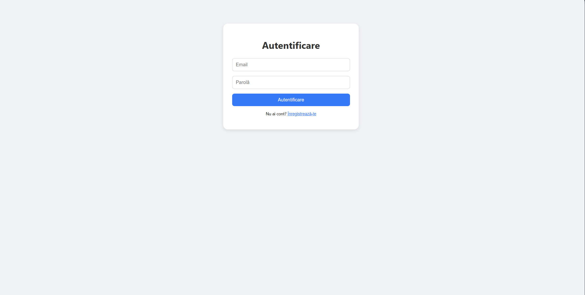
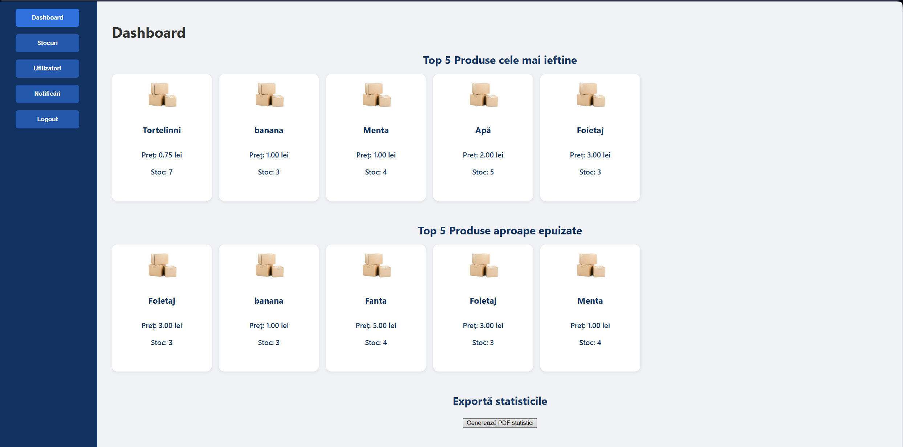
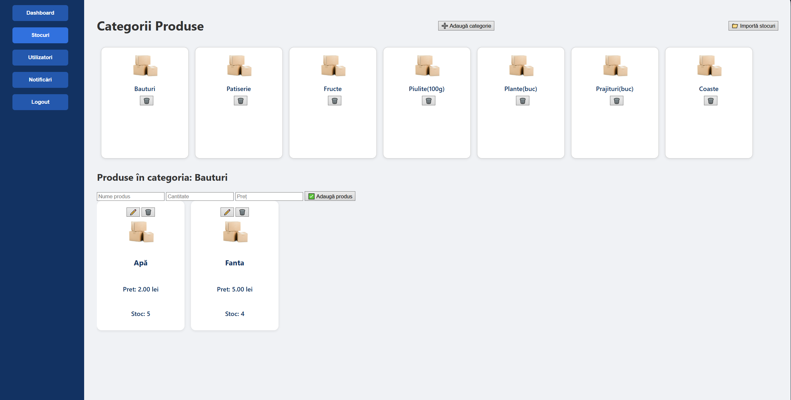
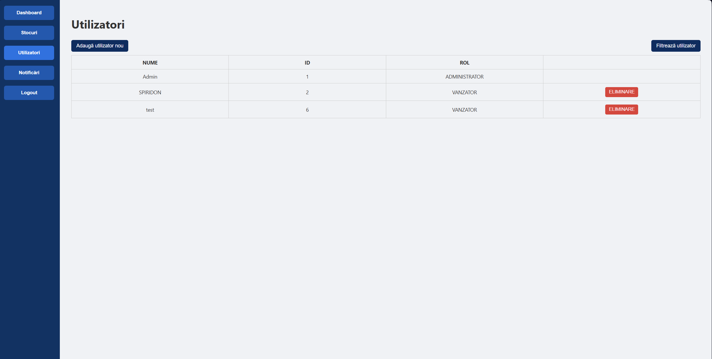
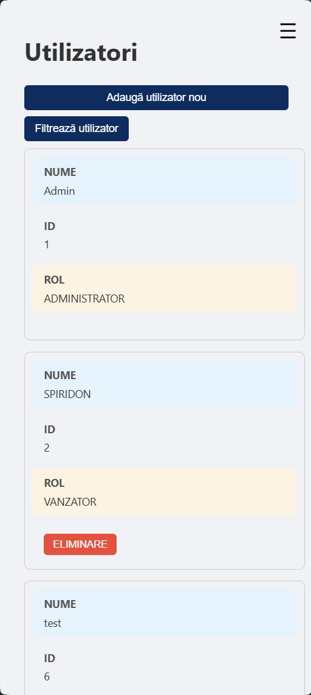

# Resource Planner: Raport de proiect

**Autori:** RobertoSpy, CoceaIustin 


---

## 1. Introducere

Resource Planner is a web application for managing and monitoring product inventories, dedicated to small and medium-sized companies. It offers features for managing items, categories, users, as well as automatic notifications for low stock.
---

## 2. Purpose of the Project

The application allows:
- Authentication based on email/password, roles (administrator/employee)
- Organization of resources by categories (bulbs, spices, toner, cosmetics, medicines, spare parts, etc.)
- Dashboard with cheap and almost sold out products
- Notifying users about stock depletion or the need to check equipment
- Signaling notifications both in the web interface and by email
- Export PDF statistics, import CSV stocks


---

## Key Features

- Product and spare parts category management
- Automatic and on-demand notifications (interface + email)
- Data import/export (CSV, JSON, XML)
- Statistics and reports (HTML/PDF)
- Multi-user (user group, dedicated notifications)
- CRUD items and categories
- CRUD users (administrator only)


## 3. Non-functional requirements

- Responsive Web Application (HTML5, CSS)
- Security: JWT, hash suite passwords
- Portability: Docker, standard SQL databases
- Open source license for code and content (MIT)
---

## 4. Usage flow

The user authenticates (as admin or employee), accesses the dashboard, manages products/categories (add, remove, modify, upload product/category files), 
receives low stock notifications, can export reports to PDF, the administrator manages employees and creates accounts for them.


## 5. Screenshots

Feature login
 

Feature Dashboard
  

Feature stock
 

Feature users logistic
 

The application has a typical client-server architecture: frontend (JS/HTML/CSS), Node.js backend (REST API), PostgreSQL database, email for notifications. The backend exposes documented OpenAPI REST endpoints.

---

## 6. Data modeling

- **item**: id, name, quantity, price, category_id, last_notification
- **category**: id, name
- **user**: id, email, name, password (hash), role
- **notification**: id, item_id, message, sent, notification_date

Data can be quickly imported via CSV.

---

## 7. Design UI

The interface is responsive, minimalist.
 


---

## 8. Stages of development

- UI prototyping & data modeling
- Frontend implementation 
- REST backend implementation & notifications
- Testing, populating with test data
- OpenAPI documentation and reporting

---

## 9. Installation & Running

### Variant available:

#### 1. **Running locally with Docker (Recommended)**
1. **Requirement:**  
   - Instalation [Docker](https://www.docker.com/get-started) on your local sistem  (Windows, Mac, Linux).
2. **Clone repository-ul:**
   ```bash
   git clone https://github.com/RobertoSpy/Resource-planner.git
   cd Resource-planner
   ```
3. **Start the application with Docker Compose:**
   ```bash
   docker-compose up --build
   ```
   The application will be accessible at `http://localhost:3000` 

4. **Test accounts:**
- You can create an administrator account and then create employee accounts from the administrator. *ATTENTION: The application will only allow you to have one administrator account, you cannot create multiple administrator accounts.

  #### 2. **Demo (temporarily on Azure)**
- The application is temporarily hosted on Azure at: 
  [https://resource-planner.azurewebsites.net](http://4.210.141.142:8081)
*ATTENTION: Demo hosting will only be available until the end of the project.*

---

### **Import/Export date**
- Example: Import products from `data/example.csv`
-Export PDF reports from dashboard

---

### **Assistance**
For installation or running questions, email directly to [robertoissues@gmail.com](mailto:robertoissues@gmail.com).
In the docs folder you have an explanatory video in Romanian that shows you how the application works. [docs/video.mp4](docs/video.mp4) (you have to download it raw)

---

## 10. Conclusion

Resource Planner offers a complete, extensible, and easy-to-use solution for resource management and automated inventory notification.
